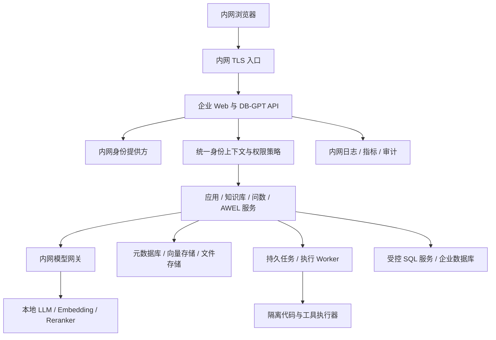

# DB-GPT 企业离线私有化二开方案

本方案按用户已确认的「单企业、完全离线内网」设计。交付内容是设计、实施任务和开发提示词，尚未实施企业功能或替换当前运行服务。

阅读顺序：本文件 → [实施计划](implementation-plan.md) → [完整提示词](development-prompts.md)。源码框架说明见 [learnProject](../learnProject.md)。团队分工、接口约定和评审边界见[团队协作指南](team-development.md)；跨阶段恢复任务时使用[交接模板](task-handoff-template.md)，架构决策记录规范见 [`adr/`](adr/)。

当前实施状态与证据见 [P0 基线报告](baseline-report.md)、[阶段任务清单](p0-task-list.md)、[路由权限核验规则](route-permission-matrix.md)、[关键函数清单](key-function-inventory.md) 和[品牌/组织模块状态](brand-and-org-module-status.md)。产品改名残留可用 `python scripts/branding_audit.py` 扫描；命名迁移完成前，该命令会以退出码 1 列出未豁免命中。扫描器只豁免 `branding-allowlist.txt` 明确列出的许可归属和集中迁移映射文件。

## 1. 目标、假设和范围

目标是在内网形成企业 AI 数据平台，支持多部门工作空间、知识问答、受控自然语言问数、Agent 应用及 AWEL 工作流。登录、模型推理、embedding、reranker、存储、审计、依赖供应和运维均在内网完成。生产环境不调用阿里云百炼或其他公网 API；如使用通义系列模型，应引入经过审批的本地权重及推理服务。

尚未确认的规划假设：首期 2 个试点部门、50–100 名注册用户、最多 10 个同时进行的模型任务、1–3 个业务数据源。此规模仅用于任务拆分，不能作为当前电脑承载能力或采购保证。现有 SSO 协议、内网 GPU、数据级别、业务 SQL 方言、备份要求和人员安排由 P0 调研收敛。

首期交付：统一登录、工作空间与授权、内网模型调用、权限约束下的知识检索/问数、工作流草稿与版本发布、受控工具、审计与备份。后续再做跨部门指标市场、复杂 Agent 协作、弹性调度和成本归集。

## 2. 当前源码和部署的具体差距

以下是对已读取源码的观察，不代表完成全项目安全审计。实施时以实际目标版本重新核查。

| 观察位置 | 当前行为 | 企业改造要求 |
|---|---|---|
| `packages/dbgpt-serve/src/dbgpt_serve/utils/auth.py` | `get_user_from_headers()` 使用请求头构造用户；无头时返回默认用户，角色为 admin | 引入可信身份验证，不能把 `user_id` 请求头当身份凭证 |
| `packages/dbgpt-serve/src/dbgpt_serve/flow/api/endpoints.py` | API key 未配置时允许访问；有 `/api/v1` 兼容放行分支 | 盘点所有版本路由，统一默认拒绝和资源授权 |
| `packages/dbgpt-serve/src/dbgpt_serve/flow/models/models.py` | Flow 有 `user_name`、`sys_code`，当前实体未见强制 workspace 外键 | 增加明确资源归属与查询范围，现有字符串不能直接当隔离保障 |
| `packages/dbgpt-serve/src/dbgpt_serve/flow/service/service.py` | `DEPLOYED` 时注册 DAG；保存/部署耦合，DAG 存于进程内 | 增加不可变版本、审批、发布及多进程一致性机制 |
| `packages/dbgpt-core/src/dbgpt/core/awel/runner/local_runner.py` | 递归运行上游，普通 upstream 当前按顺序执行 | 初期保留运行语义；异步队列放在执行任务外层，不能直接宣称分布式 DAG 引擎 |
| `packages/dbgpt-app/src/dbgpt_app/openapi/api_v1/tools/sql_query.py` | 检查部分 SQL 起始关键词；返回结果截断发生在查询之后 | 统一 SQL 网关、语法树校验、只读 DB 权限、执行超时和数据库侧限制 |
| `docker-compose.yml` | 使用上游 `latest` 镜像，只挂载配置与数据；有示例密码 | 从企业源码构建并固定镜像 digest，使用内网凭据管理 |
| `docker/base/Dockerfile` | 存在 apt/pip/Rust 等联网构建步骤 | 分离受控导入区与内网构建，形成可校验的离线依赖闭包 |
| `configs/dbgpt-proxy-tongyi-mysql.toml` | 当前配置为公网模型端点和占位 key | 新建企业离线 profile，通过内网模型服务进行真实推理验收 |

此前完成的是基础 Web/MySQL 部署。它不是企业离线部署；修改主机 `packages/`、`web/` 也不会自动改变已运行的上游镜像。

## 3. 二开方式与总体架构

建议维护企业 fork，保留 DB-GPT 的模型适配、RAG、Agent 和 AWEL 执行内核，通过服务层增加企业治理。相较于仅换 UI/反向代理，这可以覆盖后端越权、文件与检索隔离；相较于整体重写，更利于复用和跟踪上游。

初期采用模块化单体 API + 独立推理服务 + 隔离执行器。可以在内网 VM 上用容器部署；企业已有成熟 Kubernetes 运维能力时再采用集群部署。Namespace 还需网络策略、配额和其他隔离措施，不能单独代表强隔离边界。[Kubernetes 多租户说明](https://kubernetes.io/docs/concepts/security/multi-tenancy/)



图中模型网关、权限服务、任务/发布机制是拟新增能力；不能视为上游已完整提供。

推荐代码边界：企业 API、DAO、身份和权限逻辑放入拟新增 `packages/dbgpt-serve/src/dbgpt_serve/enterprise/`；应用初始化在 `dbgpt-app` 注入；连接器和模型适配继续放入 `dbgpt-ext` 或已有适配边界。权限必须进入现有业务服务，不能仅保护新增 `/enterprise` 路由而放任原有入口。尽量避免把组织权限写进 AWEL 通用核心。

## 4. 身份、部门和数据隔离

组织模型：单企业 → 部门 → 工作空间 → 成员/角色/资源。部门管理人员组织关系，workspace 管理数据和应用访问边界，支持一个人加入多个 workspace。预留 organization_id 供明确归属使用，不在首期建设多企业计费型 SaaS。

接入企业现有内网 IdP；优先评估 OIDC，只有 SAML/LDAP 时通过内网身份代理适配。服务端校验签名、issuer、audience、有效期及账号状态；登录 callback 校验 state/nonce。浏览器通过安全会话 cookie 或短期 token 访问。选中的 workspace 只是请求目标，必须服务端验证成员资格。

统一上下文建议为 `RequestContext(user_id, organization_id, workspace_id, roles, request_id, auth_method)`，由认证层构建，向 API、Service、DAO、检索、工具和后台任务传递。后台任务持久化执行者与资源范围，不能复用进程全局用户；执行时重新检查权限或使用明确限时授权快照。撤权必须对排队任务和下载链接生效。

| 角色 | 可用权限 | 必须独立的权限 |
|---|---|---|
| 普通成员 | 运行已授权应用，访问授权文档和数据 | 默认不能创建外部连接、发布工作流 |
| 开发者 | 创建草稿、使用已授权节点调试 | 调试仍按真实数据权限执行 |
| 数据管理员 | 管理数据源、指标口径、文档 ACL | 不等同于系统运维权限 |
| 工作空间管理员 | 邀请成员、分配 workspace 角色 | 不自动获取其他部门数据 |
| 发布审批人 | 审批特定版本和生产发布 | 高敏流程作者不能自批 |
| 平台管理员/审计员 | 平台配置/查看脱敏审计 | 运维身份与读取业务内容的权限分离 |

后端采用 RBAC + 资源归属/ACL 校验，操作以 `authorize(ctx, action, resource)` 收敛。所有资源查询先限制 workspace 再查询 ID；未知权限默认拒绝。权限应覆盖列表、详情、编辑、运行、调试、导入导出、分享、文件下载、动态节点选项和触发器。该原则与 OWASP 的默认拒绝、每次请求校验一致。[OWASP Authorization](https://cheatsheetseries.owasp.org/cheatsheets/Authorization_Cheat_Sheet.html)

隔离检查范围：元数据 DAO、向量 collection/filter、schema 索引、对象存储 key、文件签名下载、对话记忆、LLM 缓存、连接器缓存、DAG 实例缓存、后台索引任务。缓存键至少包含影响访问范围的 workspace/主体授权指纹和版本，避免跨部门复用结果。文档检索需在召回阶段带 ACL 条件，必要时取回前二次校验，禁止先交给模型再过滤答案。

## 5. 离线模型与依赖供应

本机 32 GB RAM / 8 GB VRAM 适合开发、轻量模型功能验证和少量请求；不能据此承诺企业推理并发。先用经过准入的小型量化聊天模型验证流程，embedding 可单独运行；实际模型尺寸、量化方式和上下文长度由显存与任务质量评测确定。生产推理节点与 API/数据库分离，GPU 选型在 P4 基准测试之后决策。

模型策略：聊天/SQL/工具调用按任务选择内网模型；embedding 固定版本与向量维度；reranker 可选但不能默认下载。内网 OpenAI 兼容服务可以沿用代理客户端，API base 必须是内网地址。兼容协议不代表某个模型支持可靠 tool calling、JSON schema、长上下文或中文 SQL，必须逐项评测。

建立模型准入清单：模型名称和版本、权重/tokenizer/config 文件 SHA256、来源、许可证与使用限制、运行时/驱动版本、上下文参数、量化方式、评测报告和负责人。生产禁止在模型文件缺失时自动拉取公网资源。框架离线环境变量只是辅助控制，网络层应阻断外发。

离线交付包建议包含：

```text
release/<version>/
  manifest.json           # 源码版本、镜像 digest、模型与依赖校验和
  images/                # docker save/OCI 镜像及架构信息
  models/                # 经过审批的完整模型文件
  dependencies/          # 内网重建所需 wheel/npm/系统依赖或仓库快照
  migrations/            # 数据库迁移、预检和恢复说明
  deployment/            # 内网配置模板，不含真实凭据
  sbom/                  # 组件清单、扫描结果、许可记录
  runbooks/              # 安装、验收、备份、回滚
```

受控导入流程：外部材料在企业批准的介质/导入区获取 → 扫描与校验 → 审批 → 导入内网制品库 → 内网构建/部署。最终验收必须在断公网、干净模型缓存、干净浏览器缓存条件下完成。覆盖 Web 字体/图标/JS、Swagger CDN、帮助链接、遥测、更新检查、模型下载、pip/npm/apt、Skill 安装和 Agent 网页工具；内部 URL 导航可保留，但不能默认放行任意地址。

## 6. 数据语义、问数与知识库

沿用连接器与 DBSummaryClient/schema retrieval，新增企业指标目录。指标记录包括业务名/别名、公式、粒度、维度、过滤条件、时间口径、单位、空值规则、数据来源、负责人、状态、版本和生效期。由数据管理员审核后发布，问数回答展示指标版本、SQL、过滤条件及数据时间。

拟定问数链路：身份/数据权限 → 查询意图和指标版本解析 → 授权 schema/指标检索 → SQL 生成 → SQL AST 策略检查 → 数据库只读执行 → 结果脱敏和规模控制 → 答案与审计。低置信度、口径冲突或越权需求先澄清，不让模型自动编造指标。

语法树检查要区分方言、多语句、CTE、外部函数、文件/网络读取和系统表；数据库只读账号与视图/行级策略作为最终权限约束。所有 SQL 路径（旧 Chat DB、编辑器、Agent SQL Tool、AWEL 节点）汇入共同执行策略。禁止把简单前缀校验当作完整只读保护；限制返回行数应在执行侧实施，不能只截断展示。

知识库流程：文件接入/校验 → 内容抽取 → 分块携带 workspace/document/version/ACL → 内网 embedding → 授权召回 → 可选本地 rerank → 带引用回答。删除/权限收回需要同时清理或失效化向量、文件、缓存和会话引用。切换 embedding 模型采用新索引构建、评测、原子切换和旧版本保留策略，禁止在原 collection 混用维度。

## 7. AWEL、Agent 与工具治理

新增独立治理状态 `DRAFT → VALIDATED → IN_REVIEW → APPROVED → PUBLISHED → RETIRED`。运行状态 `QUEUED/RUNNING/SUCCEEDED/FAILED/CANCELLED` 单独记录，不能与原 Flow `RUNNING` 混同。审批绑定不可变版本内容 hash；图、工具、模型和资源权限变化后需要重新审批。

发布版本固定：Flow JSON、operator registry/version、依赖镜像 digest、prompt/skill 版本、模型标识、资源引用和权限策略版本。凭据只保存 secret 引用。运行记录固定 release_id，后续编辑草稿不影响正在运行的实例。

多副本 API 的 DAG registry 是进程内状态。首期可用唯一执行 Worker 承载正式 DAG，API 仅提交有 workspace 和 release_id 的任务；Worker 根据不可变版本加载并缓存。后续增加 worker lease、租约过期处理和幂等消费；缓存键包含 workspace/release/hash。不能仅把当前 Web 服务副本数增加就宣布分布式工作流成立。

算子准入：稳定的 IO schema、配置参数、超时、权限类别、外发/文件/SQL/副作用声明、错误码、日志脱敏、资源配额和版本兼容策略。初期允许经过评审的内置 Python 算子与模板。Flow 导入需要类/模块白名单，不能让用户提供任意 `type_cls` 动态加载；限制任意代码节点、Skill 脚本和 MCP 工具。

代码执行进入独立低权限容器/进程隔离环境，限制 CPU/RAM/时间/文件目录，默认不允许网络和宿主 Docker socket。允许的内网工具仍需按请求鉴权与审计。写操作应具备权限、人工审批和幂等标识；提示词中的“不要危险操作”不能代替执行器控制。

任务支持取消、限时、配额、失败定位和重试策略。只对明确幂等步骤自动重试；有副作用步骤不承诺 exactly-once，使用业务幂等键和执行回执管理重复执行风险。

## 8. 数据模型与 API 草案

以下名称是建议新设计，未声称仓库已存在。

| 实体 | 关键字段/约束 |
|---|---|
| organizations/departments/workspaces | 稳定 ID、组织/部门归属、启停状态 |
| memberships/roles/role_bindings | user、workspace、role；成员和角色绑定唯一约束 |
| resource_grants | workspace、resource_type/id、主体、action、有效期；索引覆盖权限查询 |
| flow_revisions/flow_releases | workspace、flow_id、version/hash、审批人、发布人、artifact_digest；版本不可变 |
| runs/run_steps | workspace、release、actor、request/trace/idempotency key、状态、时间、脱敏错误 |
| semantic_metrics/metric_versions | 口径、来源、版本、审批、生效期 |
| model_endpoints/model_policies | 内网端点、模型版本、allowed_tasks、workspace 配额、secret_ref |
| audit_events | actor、workspace、action、resource、decision、request_id、时间；脱敏且限制修改 |

API 契约示例：`GET /api/enterprise/v1/me`，workspace membership 管理，`POST /flows/{id}/revisions`，`POST /flow-revisions/{id}/submit`，`POST /flow-revisions/{id}/approve`，`POST /flow-revisions/{id}/publish`，`POST /flow-releases/{id}/runs`，`POST /runs/{id}/cancel`，metrics/model-policy/audit 查询。所有路径执行相同认证/授权，旧 `/api/v1`、`/api/v2`、动态 Trigger 和下载入口也必须覆盖。

## 9. 运维与验收目标

开发与生产环境分离。内网 TLS/证书、DNS、时钟同步、登录签名证书轮换、元数据备份、对象存储与向量快照、镜像回滚和离线漏洞修复流程都要有负责人。

建议试点目标（需要 P0 确认，不是当前指标）：非推理 API p95 ≤ 500 ms；10 个并发模型任务下记录首 token 和完整耗时并建立可重复基线；问数黄金集 SQL 执行成功率 ≥ 95%、业务结果正确率 ≥ 90%；知识问答正确引用率 ≥ 95%；越权用例全部拒绝；所有模型和工具调用可追踪；断公网完整主链路可用。RPO 24h/RTO 4h 仅作试点提议，关键业务应重新约定并恢复演练。

首期不承诺 GPU 性能、全方言 SQL 正确性、复杂 Agent 无人工干预成功率。性能/质量结论必须同时记录模型版本、量化、上下文、硬件和评测数据集。

## 10. 与上游同步

冻结已验证上游基线，为当前未带 `.git` 的工作目录先做归档和文件 hash，核对正式上游版本来源后建立企业 fork。版本号 `0.8.2` 不能代表这份源码已与某个上游提交完全一致。保存企业补丁清单和迁移记录，按固定周期审查上游修复，在隔离分支验证后合入。

保留仓库 LICENSE 与第三方声明；模型、前端依赖、数据库及推理组件分别纳入企业许可审核。本文不替代企业法务与安全评审。
