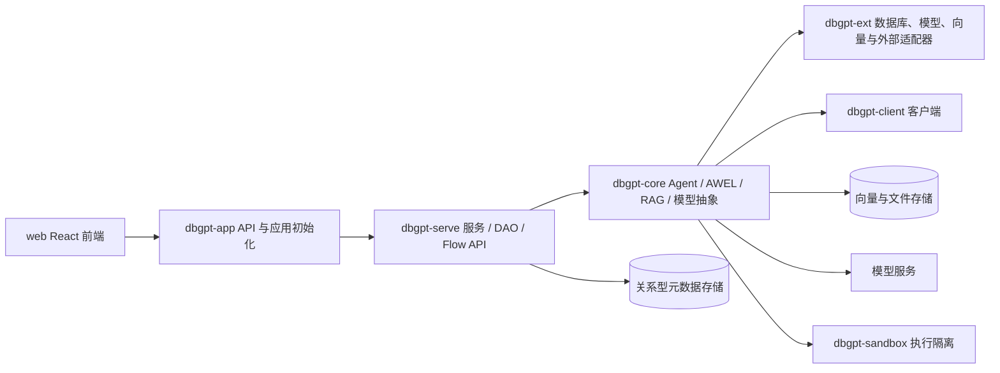

# P0 基线审计报告

审计日期：2026-09-26
工作目录：`D:\Projects\DB-GPT-main\crrc_dbChat`
分支/提交：`main` / `ffac7bb`（远端跟踪 `origin/main`）
远端：`https://github.com/hengyuan-sun/crrc_dbChat.git`

## 结论摘要

当前仓库已具备可启动的本机源码覆盖 Docker profile、Web/API 服务和 MySQL；但它还不是可验收的企业离线平台。浏览器静态资源仍带旧产品标识，当前进程没有可用的本地模型服务，公开 API 路由授权尚未逐路由核完，已有请求头认证存在默认管理员身份行为，SQL 工具的关键字过滤不足以构成只读边界。命名迁移、完整离线制品、企业身份/资源授权及关键函数中文说明均未完成。

本报告是仓库、运行状态和少数关键路径的基线，不是全面安全审计或功能验收。逐项清单见[实施任务清单](p0-task-list.md)、[路由权限核验说明](route-permission-matrix.md)和[关键函数清单](key-function-inventory.md)。

## 仓库与源码来源

| 项目 | 当前观察 |
|---|---|
| Git | `main`，HEAD `ffac7bb`；提交 `c721c41` 为当前企业仓库初始快照，`ffac7bb` 增加本机启动 profile |
| 远端 | `origin` 指向用户提供的 GitHub 仓库 |
| 上游来源 | 原工作目录未检测到 Git 元数据，无法证明初始快照对应的 DB-GPT 上游 commit。不得虚构 SHA；需后续使用原始归档校验值或可信上游 tag 建立来源记录 |
| 主版本 | 根 `pyproject.toml` 为 `0.8.2`；当前根项目名是 `crrc-dbchat-mono`，但 workspace 包名及导入命名仍为旧值 |
| 修改状态 | 基线审计时存在提示词、Logo 参考图、函数注释统计和路由矩阵等未跟踪文件；这些不是业务源代码改动 |
| Git 历史 | 保留当前两条企业仓库提交；按需求不重写历史 |

## 运行状态与部署边界

- 组合启动文件：`docker-compose.yml` 加 `docker-compose.crrc.yml`；源码覆盖镜像标签 `crrc-dbchat:local`。
- 应用容器名 `crrc-dbchat-webserver`，绑定 `127.0.0.1:5670`；MySQL 容器健康。首页和 `/docs` HTTP 状态为 200。
- 当前镜像 ID：`sha256:0497086ab6fd26a0e2cb7772ce6e496f0958498c5dd764033b06b5bcf1cea329`。Dockerfile 使用 `eosphorosai/dbgpt-openai:latest`，构建基础镜像未固定 digest，不能据此证明镜像可在断网环境复现。
- 现有 Docker 命名卷：`db-gpt-main_dbgpt-data`、`db-gpt-main_dbgpt-message`、`db-gpt-main_dbgpt-myql-db`。P0/P1 不得删除、重建或清空这些卷；数据归属和是否有用户数据尚未盘点。
- 活跃页面的 HTML/打包静态资源仍出现旧产品标识，页面未呈现新品牌；当前编译产物不是前端源码本次改造后的产物。
- 本地模型地址配置为 `host.docker.internal:11434`，端口当前不可用。服务启动不代表 LLM、Embedding、RAG、Agent 或 SQL 问答通过。
- 当前配置含演示数据库凭据、占位模型 key 和 `api_keys = []`。仅限隔离的本机试运行；不可作为共享或生产内网配置。
- 当前 profile 的向量存储指向本地 Chroma 路径。模型、索引和 MySQL 状态都应分别备份；不得将重建应用容器等同于数据迁移。
- `web/public/crrc-changchun-logo.svg` 与 `crrc-changchun-mark.svg` 已依据随附 PNG 描摹为 path-only SVG，浏览器预览与原图的红色图形/黑色字标比例相符；它们仍是待企业品牌审核的重绘稿，不代表官方矢量源文件。

## 分层与主要运行链路

这是按现有 workspace 和导入边界归纳的静态模块图，不代表依赖已完全解耦。粗略职责：`dbgpt-core` 是领域/Agent/AWEL 核心；`dbgpt-ext` 是数据库、模型和存储适配；`dbgpt-serve` 提供服务、API、DAO 与 Flow 管理；`dbgpt-app` 汇集应用 API 与启动装配；`dbgpt-client` 提供调用客户端；`dbgpt-sandbox` 处理受限代码执行；accelerator 子包提供可选加速。实际构建边界、循环依赖和运行时插件注册仍需通过构建和依赖图工具复核。

## AWEL 可视化工作流的当前实现链路

1. 前端 `web/components/flow/` 以节点清单、节点参数组件和画布组件表示 DAG 草稿；用户编辑节点参数及连线后，通过 Flow API 保存/更新 Flow 配置。
2. `dbgpt_serve.flow.api.endpoints` 把请求传到 `dbgpt_serve.flow.service.service.Service`。
3. `Service.create_and_save_dag()` / `update_flow()` 根据请求配置构造 DAG、保存 Flow 实体；当状态标记为 `DEPLOYED` 时注册到进程内 `FlowFactory`。服务启动时 `load_dag_from_db()` 会从存储重新载入已部署流程。
4. 调试或聊天请求由 Service 解析可调用任务，并通过 `LocalRunner` 的 `execute_workflow()` / `_execute_node()` 沿依赖关系运行算子；算子定义和 registry 来自 `dbgpt-core`，节点实际能力来自核心与扩展包。
5. 此链路是当前源码中的保存、注册和本地执行模型。现有代码不等于带审批、不可变发布版本、持久队列、分布式 Worker 或故障恢复的企业工作流平台。

详细安全边界、接口及关键函数见[函数清单](key-function-inventory.md)。

## 身份、组织与权限状态

- `dbgpt_serve.utils.auth.get_user_from_headers()` 将请求的 `user_id` 头直接作为用户身份并赋予 `admin`；未提供时返回固定用户 `001` 且同样是 `admin`。这不是可信企业认证，生产必须替换并覆盖所有调用入口。
- Flow API 的 `check_api_key()` 对 `/api/v1` 路径直接跳过检查；未配置 API key 时允许访问。OpenAPI schema 的安全声明只作为线索，不能证明真实授权。
- `dbgpt_serve.organization_sync` 已有只读目录快照契约、唯一性/关联校验、预览服务和测试。它没有企业目录连接器、数据库存储、管理 API、审批、审计或自动同步任务；当前没有声称组织同步已生效。
- Flow 实体当前可见 `user_name`、`sys_code` 等字段；这些字符串不是强制 workspace 归属或隔离策略。

## SQL 与数据处理风险观察

`dbgpt_app.openapi.api_v1.tools.sql_query.make_sql_query()` 当前只通过 SQL 起始关键字拦截部分写语句，之后直接调用连接器。该方式无法可靠拒绝 CTE 中的写入、注释/多语句、方言差异或危险函数；结果行/字符裁切发生在数据库返回数据之后。需以数据库只读账号/视图、统一 SQL 策略、方言感知解析、执行超时和执行侧限制共同构成边界。

上面是源码行为观察，不表示已经通过攻击用例验证。执行安全改造前，需列出所有 SQL 入口，并对目标数据库方言测试。

## 命名和中文注释基线

- 针对 `packages, web, configs, docker, docs, scripts, tests, examples, skills, i18n, assets` 中可读取文本的区分大小写扫描，`dbgpt` 命中 25,123 次 / 1,687 个文件；`DB-GPT` 2,170 / 633；`DBGPT` 628 / 183；`db_gpt` 53 / 21；`DB_GPT` 18 / 8；`db-gpt` 33 / 19。不同词形会重叠。扫描排除了二进制文件及上述目录之外的根文件，因此是迁移规模基线，不是全仓“零残留”验收。
- 目前根项目名已改为 `crrc-dbchat-mono`；workspace 目录、Python import、ruff 包配置、配置文件、静态资源、CLI 和数据标识仍包含旧命名。
- AST 扫描 `packages/*/src/**/*.py` 得到 10,778 个函数/方法：6,269 个有 docstring，约 120 个 docstring 含中文字符，4,509 个没有 docstring。逐包数见 [`python-function-docstring-baseline.csv`](python-function-docstring-baseline.csv)。这是字符级统计，不判断文档是否准确、完整或有用；关键函数仍需逐项人工审查。
- 用户明确要求所有关键函数有中文说明。先建关键函数清单并按子系统分批处理，拒绝通过机械生成相同模板注释来“达标”。

## 验证基线

| 检查 | 结果 | 说明 |
|---|---|---|
| Docker 应用容器 | 运行中 | MySQL 健康；数据是否可恢复尚未做演练 |
| `GET /`、`GET /docs` | HTTP 200 | 只证明页面/API 文档可达 |
| 模型服务 | 未连接 | `11434` 当前不可用；不能验收真实推理 |
| OpenAPI | 364 operations / 326 paths | 生成路由矩阵用于审阅；尚未逐路由核查认证、workspace 范围和对象级授权 |
| 组织同步模块单测 | 4 项通过（此前本机运行记录） | 只覆盖契约校验与只读预览，不覆盖真实 IdP/持久化/同步 |
| 本次扫描器测试 | 4 项通过 | 覆盖区分大小写、行号、精确豁免、二进制跳过和 Windows GBK 控制台下 UTF-8 JSON 输出 |
| 组织同步契约测试（本次重跑） | 4 项通过 | 通过显式设置各 workspace `src` 路径运行 |
| 命名残留审计 CLI | 运行成功并返回残留 | 当前有 40,398 个“行/标识”命中项；映射词形有重叠，不能视为 40,398 个独立源码改动 |
| 前端依赖与构建 | 未完成 | `npm ci --offline` 因缓存缺少 `zwitch@2.0.4` 退出；官方 registry 重试在 npm 本机缓存写入时报 `EEXIST/EBADF`。当前没有 `node_modules/.bin/next`，前端测试和生产导出未运行；`package-lock.json` 未改 |
| 全量 Python 测试 | 收集阶段失败 | 裸 Python 环境缺依赖（首个代表错误为 `ModuleNotFoundError: cachetools`）；pytest 汇总 138 个 collection errors、2 skipped。不是代码通过结果，也不能据此判断 138 个独立产品故障 |
| Ruff 检查 | 未运行 | 当前 Python 环境没有安装 Ruff（`No module named ruff`） |
| 测试文件规模 | 178 个 package 测试文件、根 `tests` 下 17 个 | 文件数不代表通过数；当前全量测试未能完成收集 |
| Python / Node / npm | Python 3.14.6 / Node 24.19.0 / npm 11.17.0 | 记录环境版本；依赖兼容性与生产版本策略未确定 |
| 离线安装与断公网启动 | 未运行 | 目前使用可变 `latest` 基础镜像，不满足可复现离线供应链证明 |

测试基线记录的是已有结果。后续改动验收必须重新运行对应测试并附原始命令和结果；不得把此前的局部测试通过扩大解释为全系统通过。

## 需要业务/平台侧补齐的决策

1. 内网统一身份提供方、组织目录的权威源/字段、禁用用户和离职用户策略、审批责任人。
2. GPU/CPU 资源、操作系统/容器运行时、离线制品库、推理框架及允许导入的模型工件和许可证。
3. 数据库方言、只读账号、受控视图、数据分类、文档 ACL 权威源、数据保留与审计周期。
4. 试点部门、真实问数/知识问答黄金集、并发/SLA、备份 RPO/RTO 及恢复责任人。
5. 企业官方矢量 Logo；当前保存文件是 PNG 参考稿。重绘的 SVG 必须经品牌责任人确认。

这些输入不妨碍先完成代码盘点、命名映射、依赖闭包清单、注释覆盖治理和组织同步接口扩展，但在其缺失时不能宣称生产验收完成。
